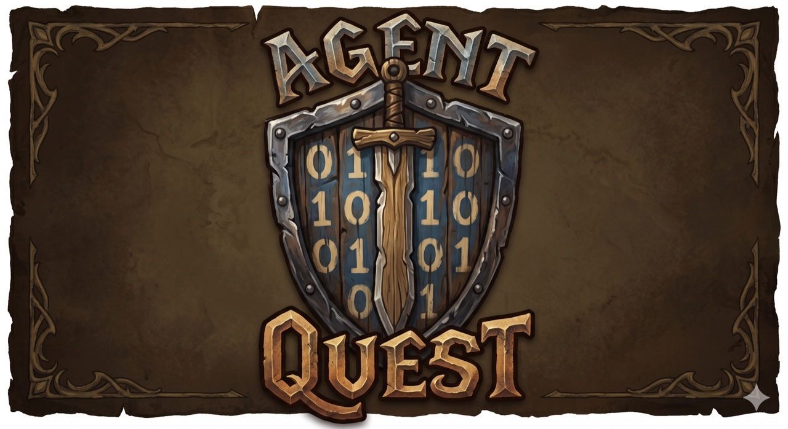
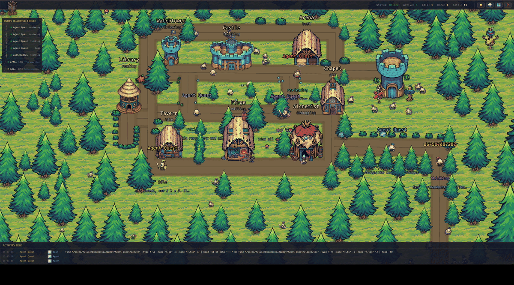
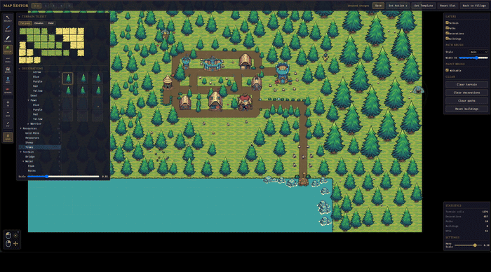
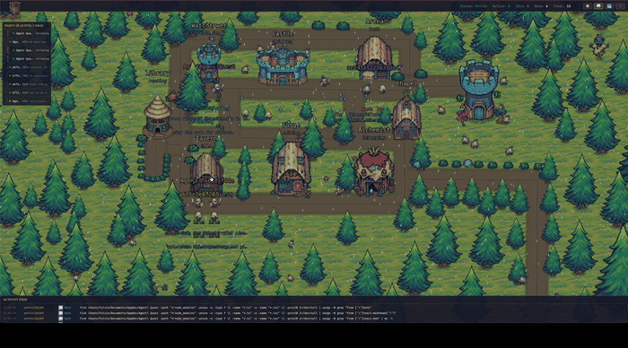

<p align="center">
  
</p>

<p align="center">
  <strong>A fantasy village dashboard for monitoring your Claude Code CLI and Codex agents.</strong>
</p>

<p align="center">
  <a href="LICENSE"></a>
  <a href="https://bun.sh"></a>
</p>

---

> **Use Claude Code CLI or Codex as usual — each agent session auto-spawns a hero on the dashboard, live.**

Agent Quest is a browser-based monitoring dashboard that visualizes active Claude Code and Codex agent sessions as fantasy heroes in a 2D village. Each running agent becomes a hero who walks between buildings based on what it's doing: `Read` sends it to the Library, `Edit` to the Forge, `Bash` to the Arena, and so on.

<p align="center">
  
  <br/>
  <sub><em>Every hero is an agent — the building it visits tells you what it's doing.</em></sub>
</p>

<table align="center">
  <tr>
    <td align="center" width="50%">
      
      <br/>
      <sub><em>Integrated Tile Map Editor</em></sub>
    </td>
    <td align="center" width="50%">
      
      <br/>
      <sub><em>Weather effects</em></sub>
    </td>
  </tr>
</table>

## Why?

Claude Code and Codex sessions happen in a terminal — useful, but not very *alive*. When you run several agents at once (across projects, across `~/.claude*` installations and `~/.codex`), it's hard to feel what they're actually doing. Agent Quest turns that invisible activity into something you can glance at: a little village where every hero is an agent, and where they walk tells you what they're up to.

## Features

- Real-time visualization of active Claude Code and Codex sessions
- Auto-discovery of every `~/.claude*` directory (supports multiple installations like `~/.claude-work`, `~/.claude-personale`) and of `~/.codex` if present
- Activity feed, party bar, and detail panel alongside the village scene
- Built-in map editor for customizing the village layout
- Sub-2s latency via native WebSocket (optional lower-latency path via Claude Code `postToolUse` hooks — Claude Code only; Codex doesn't expose hooks)
- **Cost & token tracking** — per-session and fleet-wide spend estimates
- **Construction sites** — in-progress Linear projects rendered as buildings that finish as their issues close
- **Generated roads & scenery** — tracks worn between buildings by use, and woodland that never grows through a wall

See [What this fork adds](#what-this-fork-adds) for the details.

## What this fork adds

This is a fork of [FulAppiOS/Agent-Quest](https://github.com/FulAppiOS/Agent-Quest) with three additions.

### Cost & token tracking

Every Claude session's token usage is already parsed out of the JSONL; this fork prices it. A per-session estimate appears in the Detail Panel and the Report tab, and a fleet-wide **Spend** total sits in the top bar.

The pricing table lives in [`server/src/pricing/model-pricing.ts`](server/src/pricing/model-pricing.ts) and is keyed by model *family*, so new dated or Bedrock-style model ids resolve without edits. A few caveats the UI keeps visible:

- It's **public list prices**, not your invoice. On a Pro/Max subscription it shows what the same usage *would* cost on the API.
- Cache writes are priced at the 5-minute TTL rate (1.25×); 1-hour-TTL writes cost more, and the JSONL doesn't distinguish them.
- A model with no published rate makes the figure a lower bound, shown as `≥ $x.xx`.
- Codex reports no token usage, so Codex sessions are excluded.

### Generated roads & scenery

Roads are no longer drawn by hand. Every track is a **desire path**: the map works out which buildings want a direct link (a minimum spanning tree for the backbone, plus Gabriel-graph edges for the shortcuts a village actually has), routes each one *around* the buildings in the way, and wears it wider where more journeys funnel through it. Heroes walk the same network, so they can't clip through a wall.

Trees, shrubs, rocks and mushrooms are scattered procedurally against the current layout, with per-kind clearances — a mushroom can sit at a road's edge, a tree keeps well back. Woodland follows a low-frequency density field so it clumps and thins naturally, and thins further near settlements so villages sit in their own clearings. Everything is seeded, so the same world regenerates identically on every reload.

Both regenerate when the Linear hamlet gains or loses a building, so a new project arrives with lanes already running to it.

> The map editor's **path tool no longer affects the village view** — roads come from the generator. Its terrain, building positions, spawn point, NPCs and placed features (water, mines) are all still used.

### Construction sites (Linear)

Connect a Linear account and every in-progress project becomes a building site in its own hamlet west of the village, connected back by generated lanes. The building rises out of its scaffolding as the project's issues close, and the site's caption shows `NN% · done/total`.

**Connecting.** Open the 🏗️ panel in the top bar and paste a personal API key — create one in Linear under **Settings → Security & access → API keys**. The key is verified against Linear before it's accepted, so a typo is reported straight away rather than silently failing on the next poll. Sites appear immediately; no restart.

The key is saved to `server/data/linear.json` so it survives restarts. That file is gitignored and written `0600`, but **it holds a live credential in plaintext** — treat it like any other secret on the machine, and revoke the key in Linear if it's exposed. It is never sent back to the browser; the UI only ever shows the last four characters.

Setting `LINEAR_API_KEY` in the environment still works and takes precedence. When it's set, the in-app controls are hidden and the panel says the key is externally managed, so a browser tab can't silently override an operator's explicit configuration.

> **LAN mode.** Like every other endpoint in this project, the connect endpoint is unauthenticated. With `AGENT_QUEST_LAN=1` anyone on your network can change which Linear workspace the dashboard reads (they can't read the key back). Keep LAN mode for trusted networks.

Behaviour worth knowing:

- Only projects in a `started` or `planned` state appear; `completed`, `canceled`, and `backlog` are excluded.
- Progress comes from Linear's own `progress` field, so it honours your workspace's estimate and canceled-issue rules.
- The map has six plots; the panel lists **every** in-progress project and can pan the camera to any placed site. Projects still open at 100% sort to the back so the yard shows work actually under way.
- Polls every 2 minutes (`AGENT_QUEST_LINEAR_POLL_MS`). A failed poll keeps the last good state rather than clearing the map; disconnecting clears it, since sites for a workspace we can no longer read are stale by definition.

## Requirements

**Required**
- [Bun](https://bun.sh) 1.1 or later — the runtime behind both the server and the scripts. If you don't have it: `curl -fsSL https://bun.sh/install | bash`
- An active Claude Code or Codex installation (one or more `~/.claude*` directories, and/or `~/.codex`, with session logs). Without either, the dashboard still starts, but the village stays empty and a banner tells you so.
- See the [Platform matrix](#platform-matrix) below for OS support per provider.

**Optional**
- [Node.js](https://nodejs.org) 20+ with npm — only if you prefer the `npm run …` command form. If you only have Bun installed, every `npm run X` in this README has an equivalent `bun run X`.

## Quick start

Agent Quest can be set up in **two equivalent ways** — pick the one that matches your platform:

- **Manual install (classic)** — `git clone` + `bun install` + `bun start`. Three commands, full control, works everywhere (macOS, Linux, Windows via WSL2).
- **One-line install (macOS only)** — a single `curl | bash` that installs Bun if missing, clones the repo, installs dependencies, creates a global `agentquest` command, and launches the app.

They do the same work under the hood. Every daily command has an equivalent:

| With the CLI        | Without (classic)                      |
|---------------------|----------------------------------------|
| `agentquest`        | `bun start`                            |
| `agentquest update` | `git pull --ff-only && bun install`    |

`agentquest update` is a convenience command for end users running an installed copy that tracks `origin/main`. It is not the contributor workflow for feature branches.

### Manual install

Three commands — works on macOS, Linux, and Windows via WSL2:

```bash
git clone https://github.com/sambeevors/Agent-Quest.git
cd Agent-Quest
bun install
bun start
```

That's it: your browser opens on <http://localhost:4445> and the village appears.

Optional — create an `agentquest` shortcut so you can launch from any directory:

```bash
mkdir -p ~/.local/bin
ln -s "$PWD/bin/agentquest" ~/.local/bin/agentquest
```

After the symlink you can run `agentquest` (alias of `bun start`) and `agentquest update` (alias of `git pull --ff-only && bun install`) from anywhere.

Agent Quest ships with a bundled CC0 pixel-art sprite pack (under `client/public/assets/themes/tiny-swords-cc0/`), so there's nothing else to download.

### One-line install (macOS only)

*The one-line installer script is macOS-only; Agent Quest itself runs on macOS and Linux, and via WSL2 on Windows — see the manual install above.*

```bash
curl -fsSL https://raw.githubusercontent.com/sambeevors/Agent-Quest/main/install.sh | bash
```

The installer prints exactly what it's going to do and asks before touching anything. It checks/installs Bun, clones into `~/agent-quest` (override with `--dir <path>`), runs `bun install`, creates an `agentquest` shortcut in `~/.local/bin/`, and offers to launch right away. When it finishes, your browser opens on <http://localhost:4445> and the village appears.

From the next session onwards:

```bash
agentquest            # same as `agentquest start` — launches and opens the browser
agentquest update     # git pull + bun install (preserves local map edits)
```

## Troubleshooting

**`bun: command not found`** — install Bun first, then re-run the Quick start:

```bash
curl -fsSL https://bun.sh/install | bash
```

**`Cannot find module …` on startup** — dependencies weren't installed. From the repo root:

```bash
bun install
```

**`EADDRINUSE` on port 4444 or 4445** — another process holds the port. Either free it or override the port via env (see [Configuration](#configuration)). To see what is holding it and kill it:

```bash
lsof -ti:4444,4445 | xargs kill -9
```

**`agentquest: command not found` after install** — `~/.local/bin` is not in your `$PATH`. Add it:

```bash
echo 'export PATH="$HOME/.local/bin:$PATH"' >> ~/.zshrc && source ~/.zshrc
```

**Empty village with a "No Claude Code or Codex installation detected" banner** — expected when no `~/.claude*` or `~/.codex` directory with session logs exists. Start a Claude Code or Codex session and heroes appear automatically (the banner disappears on its own).

**Assets look broken or the app blocks at boot with "missing asset" screens** — see [Missing assets](#missing-assets).

## Configuration

Defaults work out of the box. To customize ports or URLs, copy the example env files:

```bash
cp server/.env.example server/.env
cp client/.env.example client/.env
```

| Variable | Where | Default | Purpose |
|---|---|---|---|
| `PORT` | server | `4444` | HTTP + WebSocket port |
| `CLIENT_URL` | server | `http://localhost:4445` | CORS origin |
| `CLIENT_PORT` | client | `4445` | Vite dev server port |
| `VITE_SERVER_URL` | client | `http://localhost:4444` | Server HTTP base |
| `VITE_WS_URL` | client | `ws://localhost:4444/ws` | Server WebSocket URL |
| `LINEAR_API_KEY` | server | *(unset)* | Linear API key. Optional — the key is normally set from the app. Takes precedence when present |
| `AGENT_QUEST_LINEAR_POLL_MS` | server | `120000` | How often to poll Linear |

## Development

```bash
npm start              # server + client concurrently   (or: bun start)
npm run dev:server     # server only (:4444)            (or: bun run dev:server)
npm run dev:client     # client only (:4445)            (or: bun run dev:client)
npm run check:assets   # verify every bundled sprite is on disk (or: bun run check:assets)
cd server && bun test  # run server tests
cd client && bun test  # run client tests
```

For installed end-user copies that follow `main`, `agentquest update` runs the equivalent of `git pull --ff-only && bun install` while preserving local map edits. Contributors on feature branches should use normal Git commands instead.

### Missing assets

If you accidentally delete or move files under `client/public/assets/themes/tiny-swords-cc0/` (hero spritesheets, building PNGs, terrain, decorations), Agent Quest will tell you:

- The **main app** blocks at boot with a screen that lists the missing files grouped by category (hero / building / terrain / decoration) and suggests a restore command.
- The **map editor** shows a dismissible banner at the top with the same breakdown — the editor stays usable so you can keep working.
- Run `bun run check:assets` any time to verify the whole bundled pack ahead of starting the app. Exits non-zero with a detailed list if anything is missing — good for CI or pre-commit.

Restore with:

```bash
git checkout -- client/public/assets/themes/tiny-swords-cc0/
```

## LAN access (view from your phone / iPad)

By default the dev servers only listen on `localhost` for security. To share the village with other devices on the same Wi-Fi (phone, tablet, another laptop), opt in with a single env flag:

```bash
# macOS / Linux — one-off, for this run only
AGENT_QUEST_LAN=1 agentquest          # (or: AGENT_QUEST_LAN=1 bun start)

# Permanent — decide once, then just run `agentquest`
echo "AGENT_QUEST_LAN=1" >> ~/agent-quest/server/.env
echo "AGENT_QUEST_LAN=1" >> ~/agent-quest/client/.env
agentquest
```

Any env var documented in this README works identically with `agentquest` — just prefix it on the command line, or add it to the two `.env` files for a persistent choice.

At startup the server prints reachable LAN URLs, for example:

```
[Server] LAN mode enabled — reachable from other devices at:
[Server]   http://192.168.1.42:4444 (API)  |  http://192.168.1.42:4445 (UI)
```

Open the UI URL on the other device. The client auto-detects the host so API and WebSocket calls go to the same Mac. The first time, macOS asks to allow incoming connections — click **Allow**.

> **Security note.** LAN mode exposes your agents' tool calls, file paths and command output to anyone on the same network. Fine at home; think twice on office / café / conference Wi-Fi.

## Platform matrix

|             | macOS | Windows              | Linux |
|-------------|-------|----------------------|-------|
| Claude Code | ✓     | ✓ (WSL2 recommended) | ✓     |
| Codex       | ✓     | not yet verified     | not yet verified |

Claude Code is exercised on macOS and Windows (via WSL2). Codex has been tested on macOS only so far — it should work on Windows/Linux the same way (the provider watches `~/.codex/sessions/`), but we haven't confirmed it yet.

## Windows

Bun officially supports Windows (1.1+), but we don't exercise this project on native Windows and a few dev-tool edge cases exist (file watching under certain paths, spawn semantics). For a frictionless experience on Windows, run Agent Quest inside **WSL2**:

1. Install WSL2 following [Microsoft's guide](https://learn.microsoft.com/en-us/windows/wsl/install) (one command: `wsl --install` in an admin PowerShell).
2. Open your WSL2 shell (Ubuntu by default) and install Bun:

   ```bash
   curl -fsSL https://bun.sh/install | bash
   ```

3. Follow the [Manual install](#manual-install) steps above, inside the WSL2 shell. The one-line installer is macOS-only.

Native Windows (PowerShell / cmd.exe) should also work after this project's cross-platform shell fixes, but isn't routinely tested. If you hit a Windows-only issue, please open a ticket — pull requests welcome.

## Contributing

Issues and pull requests are welcome — bug reports, feature ideas, new building sprites, extra hero classes, anything. See [`CONTRIBUTING.md`](CONTRIBUTING.md) for the short version.

## Credits

- Original project: [Agent Quest](https://github.com/FulAppiOS/Agent-Quest) by [Fulvio Scichilone](https://github.com/FulAppiOS). This repository is a fork; the village, the provider architecture, and the map editor are their work.
- Sprites, tiles, and decorations: [Tiny Swords](https://pixelfrog-assets.itch.io/tiny-swords) by Pixel Frog — licensed [CC0 1.0 Universal](client/public/assets/themes/tiny-swords-cc0/LICENSE.txt) (public domain dedication). Bundled under `client/public/assets/themes/tiny-swords-cc0/`.

## License

[MIT](LICENSE) — © 2026 Fulvio Scichilone (original work), © 2026 Sam Beevors (fork modifications).
